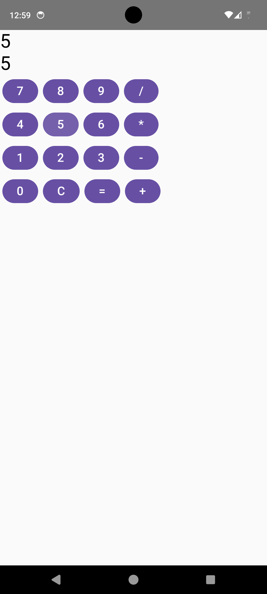
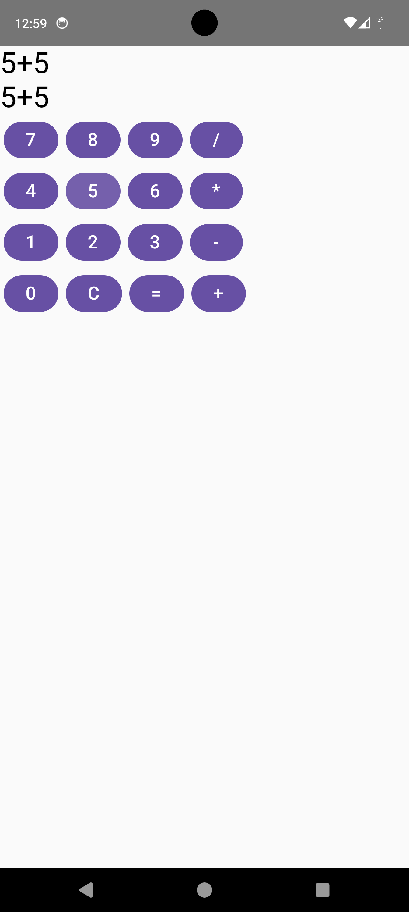

# Compose Calculator App

A simple calculator app built using **Kotlin** and **Jetpack Compose**.

## 🚀 Features
- Basic arithmetic operations (+, -, *, /)
- Clean UI using Jetpack Compose
- State management using remember and mutableStateOf
- Responsive layout

## 🛠 Tech Stack
- Kotlin
- Jetpack Compose
- Android Studio

## 📱 Preview

### Entering First Number

### Entering Second Number

### Final Result

## 🎯 What I Learned
- How to build UI using Jetpack Compose
- Managing state in Compose
- Structuring composable functions
- Connecting UI with business logic
- Pushing Android projects to GitHub

---

This project was built as part of my Android development learning journey.
